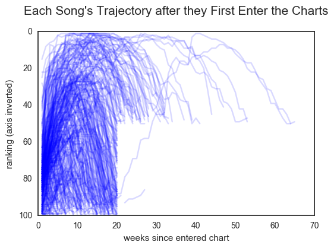
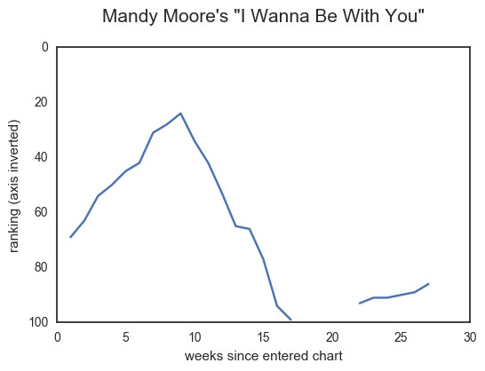
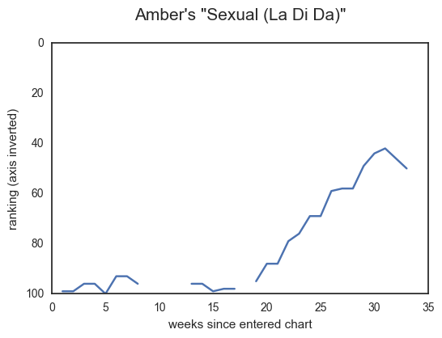
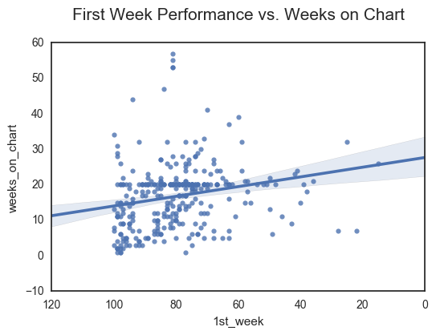
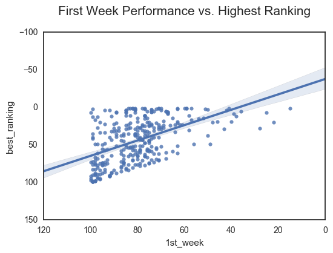

I recently worked on a project where I got to explore the Billboard Top 100 charts from the year 2000, and I wanted to share some of my more interesting findings.

### Track Names
One interesting finding from this project was about what words appeared most in track names in the year 2000. [This word cloud](https://public.tableau.com/views/TopWordsfromBilboard100TrackNames2000/Dashboard1?:embed=y&:loadOrderID=0&:display_count=yes) I created shows the most common words - the bigger the word, the more frequently it appeared. As you can see, words like "I", "Love", and "You" are relatively frequent. This is not at all surprising, if you think about how popular love songs have been for generations. What was more interesting was the prevalence of words like "wanna" and "u", shorthand slang that likely appeals to a younger audience. Interestingly, if you look in more recent Billboard 100 charts, all of these words seem frequent even today.

### Recurrents
Another interesting finding came out of the following graph of the trajectories of every song in my dataset. Because it's pretty messy and hard to read - I would never publish this in a report! - I will tell you a little of how to read it before you start looking at it. There are 317 lines tracking the trajectory of each song: how it did on its first week on the charts, then its 2nd, then 3rd, and so on until it goes off the chart altogether. I inverted the axis so that #1 will be on the top (since that's the best ranking). To make it a little easier to read, I made the lines somewhat translucent so you can tell where a bunch of lines are (where it gets darker). Okay, now you can look at the graph:

I'm sure the first thing you noticed was the lack of data in the lower right section (there's not much else to see here...). That's what I noticed too! Almost no songs go past 20 weeks unless they are above 50 - and there are some very unnatural lines forming (vertically at weeks=20 and horizontally at rankings=50). First off, this goes to show how important it is to visualize your data in a variety of ways, even if it's probably not going to make a great representation. This led me to do some digging and I found that the [Billboard 100 Wikipedia](https://en.wikipedia.org/wiki/Billboard_Hot_100#Recurrents) page talks about something called "Recurrents", or songs that they take off the charts after 20 weeks if they don't rank above 50. They do this to keep the list "current." This would explain the graph! If you're curious, the two exceptions were Mandy Moore's "I Wanna Be With You" and Amber's "Sexual (Li Da Di)". Their trajectories are below:

As you can see, "I Wanna Be With You" rose and fell in a pretty normal way (it fell off naturally before week 20), but then popped back on the charts a few weeks later. On the other hand "Sexual (La Di Da)" barely hit the charts in its first 20 weeks and then finally rose on the charts after many, many weeks. The Wikipedia site suggests that Billboard executives can choose what Recurrent songs will go back on the charts if they suspect it is making a comeback, so maybe they predicted both these songs were going to make a comeback, but were only correct about one of them...

### Prediction Power of First Week Performance
The last interesting finding I'd like to share is this: how high a song ranks when it first hits the charts is not strongly predictive of how well it will do overall (in terms of how high it gets and how long it stays on the charts). The scatterplots below demonstrate these relationships:

The first graph above has a Pearson's r-value of -0.22 (negative because weeks on chart is better when higher and rankings is better when lower/closer to 1). This r-value is quite low, suggesting a weak relationship. The second graph has a Pearson's r-value of 0.51, which is perhaps deceptively high because a song's best ranking can't be below its current ranking, so you'll see a line at the bottom of the spread of data as a result. Overall, not predictive at all!

However, I also found that each week, a song's placement is more predictive of how long it'll. So, if you want to predict how long a song will last, you'll be better off guessing based on the 2nd week, 3rd week, 4th week, etc. instead. The first week is not a good bellwether. I'll spare you the graphs on these, but suffice it to say that by the 4th week, the r-value of the relationship between ranking and how long a song lasts goes from -0.22 to -0.45, and -0.55 by the 7th week. If you take out the songs that were artificially removed from the charts at week 20, the r-values get even better. However, this is still not a super strong relationship.

That's all I have to share with you today, folks! I hope to look into more years' datasets and see what kinds of patterns stick and what patterns change. If and when I do, I'll share what I find!
