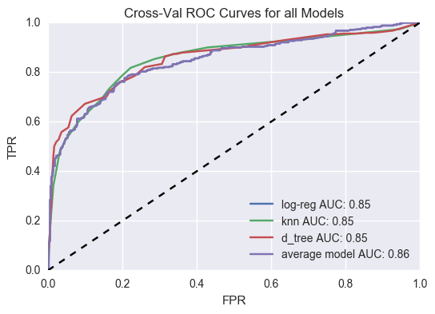

I recently worked on a project where I got to show off some of my predictive modeling skills by making a few different models to predict RMS Titanic passenger survival. I used a cross-validated grid search to find the best logistic regression model I could, the best K-Nearest Neighbors model I could, and the best Decision Tree model I could. Once I had these three models, I wanted to compare them and select the best. To my surprise, they all performed almost identically.
### Background
If you want to know a little about the data, check out my Tableau [here](https://public.tableau.com/views/TitanicVisualizations_0/Story1?:embed=y&:display_count=yes). Suffice it to say, survival was not distributed evenly on the Titanic. Women and children did out-survive everyone else, but it was particularly the wealthier women and children. Poor men barely had a chance.
### The model
For these models, I selected age, sex , class, number of siblings/spouses, and embarkation port to predict survival. I'll spare you the details of each model, but I've included a Receiver Operating Characteristic curve of all the models in the image below. For now ignore the purple curve. As you can see, each model produces almost the same curve. This means that each model performs just as well as the others at any and all thresholds.

### Ensemble Model
Mostly out of curiosity, I wanted to see what would happen if I made a prediction based on *all* of the models, instead of only one at a time. I figured that each of these models probably predicts incorrectly in different ways since they are using different methods, so maybe the errors in one model could counteract the errors in another. Sure enough, when I averaged the probabilities produced in each model, this average (or "ensemble") model out-performed all three! That's the purple curve above. It doesn't out-perform all of them at all levels, but overall it is better than each one alone. Pretty cool, huh?!

### Moral of the Story
To be completely honest, there's no moral yet! I am going to do some further exploration and see what else I can learn about this data. Wish me luck!
